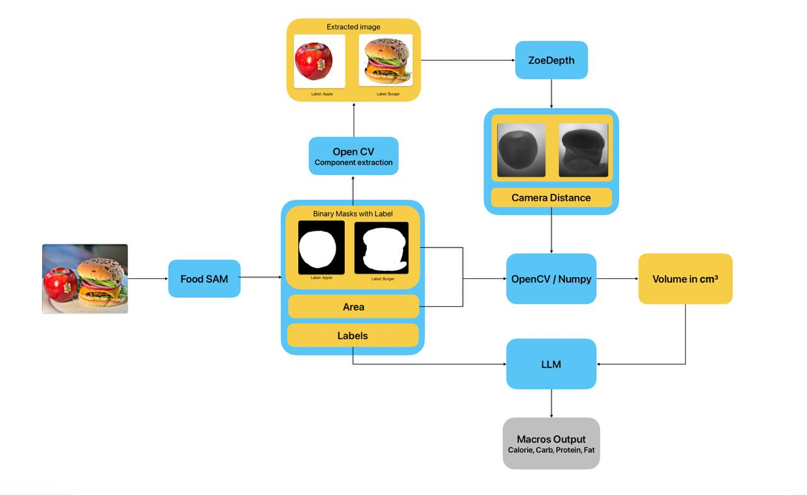
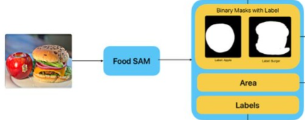

# Automated Food Quantity & Nutrition Estimation  
### _FoodSAM + ZoeDepth + OpenCV + VLM-Based Nutrition Prediction_

> **Note:** Early-stage experiments and preliminary work for this project are available in a separate repository [here](https://github.com/iraheers/project-learning).

This project implements a **complete end-to-end pipeline** for estimating food quantity and predicting macro-nutrients directly from a single RGB image.  
The system integrates **FoodSAM segmentation, ZoeDepth monocular depth estimation, OpenCV-based volume approximation, and Vision-Language Models (VLMs)** to output:

- **Calories**
- **Carbohydrates**
- **Protein**
- **Fat**
- **Mass (g)**
- **Volume (cm³)**

---

## **Project Overview**

Traditional vision-language models (VLMs) hallucinate food quantities because they rely only on visual appearance and lack geometric cues.  
This project solves that by adding **structured context engineering**:

1. **FoodSAM** → precise instance masks  
2. **OpenCV** → area extraction + mask stats  
3. **ZoeDepth** → pseudo-metric height estimation  
4. **Volume Approximation** → OpenCV + NumPy  
5. **LLMs / VLMs** → nutrition inference using structured prompts  

This combination dramatically improves reliability over VLM-only methods.

---

## **Pipeline Architecture**

Below is the system pipeline used in this project:

---

## **Key Components**

### **1. FoodSAM – Food-Specific Segmentation**
- Takes the full food image as input and isolates each item using high-quality instance masks.
- Generates separate binary masks for every detected food (e.g., apple mask, burger mask).
- Assigns the correct category label to each mask as shown in the diagram.
- Computes per-item pixel area, which is required for later volume and nutrition estimation.
- Outputs a clean, structured representation {mask, label, area} for every food item, which is passed to the next stage of the pipeline.

### **2. ZoeDepth – Monocular Depth Estimation**
- Converts 2D crop into pseudo-metric height maps  
- Used to estimate volume when combined with mask area  
- More stable and accurate compared to MiDaS / DPT

### **3. OpenCV + NumPy – Volume Approximation**
- Computes:
  - per-pixel area coverage  
  - depth statistics (height, thickness)  
  - simple geometric volume approximation  
- Volume → input signal for nutrition estimation

### **4. LLM/VLM Nutrition Inference**
Structured context passed to LLaVA, LLaMA-4, FoodQwen, and FoodLMM:

- mask area in pixels  
- item label (if inferred)  
- depth-derived height estimate  
- volume estimate (cm³)  
- segmented crop of each food item  

Structured prompting significantly reduces hallucinations and increases macro-prediction accuracy.

---

## **Results Summary**

### **Part A — VLM-Only Predictions (No Geometry)**  
Performance was unstable and inconsistent.  
MAE values were significantly higher.

### **Part B — Geometry-Aware Predictions (Our Pipeline)**  
Integrating segmentation + depth + volume reduced errors substantially.

#### **Part A Model Comparison**

| Model | Calories | Mass | Fat | Carb | Protein |
|-------|----------|-------|------|--------|----------|
| FoodQwen 2.5VL 7B | 148.56 | 112.03 | 10.87 | 17.87 | 15.14 |
| FoodQwen 3B | 135.49 | 106.53 | 7.70 | 9.48 | 12.52 |
| LLaVA | 196.77 | 210.40 | 15.00 | 19.49 | 19.23 |
| LLaVA 1.6 | 185.19 | 130.83 | 21.23 | 39.12 | 23.65 |
| LLaVA-One-Vision | 221.20 | 142.99 | 10.10 | 27.38 | 15.82 |
| LLaMA-4 MAE | 128.44 | -- | 7.60 | 11.02 | 11.74 |
| **FoodLMM (Baseline)** | **67.3** | **39.7** | **5.4** | **5.9** | **4.1** |

#### **Part B – Proposed Pipeline vs Baselines**

| Metric | Proposed Pipeline | FoodLMM | LLaMA-4 |
|---------|----------------|-----------|-----------|
| Calories | **78.15** | **67.3** | 128.44 |
| Mass | **324.86** | **39.7** | -- |
| Carbs | **14.92** | **5.9** | 11.02 |
| Protein | **5.98** | **4.1** | 11.74 |
| Fat | **6.55** | **5.4** | 7.60 |
 
Even though FoodLMM baseline performs extremely well, our geometry-aware pipeline **outperforms VLM-only predictions** and demonstrates the impact of combining segmentation + depth + geometry + structured prompting.

---

## **Datasets Used**
- **Nutrition5k** – for calorie, macros, mass ground-truth  
- **UECFOOD256** – used for YOLO training in earlier versions  
- **USDA FoodData Central (Potential Future Work)** – planned for macro lookup tables  

---

## **Future Work**

- Integrate **USDA FoodData Central API** to replace LLM nutrition estimation with factual database lookups.  
- Evaluate pipeline end-to-end on the **full Nutrition5k dataset**.  
- Replace simple geometric volume assumptions with **3D mesh reconstruction** (InstantMesh, One-2-3-45, SMR).  
- Real-world calibration using a reference object (coin, plate diameter).  
- Investigate transformer-based multimodal fusion for geometry + vision input.

---

## **Acknowledgements**

This project heavily relies on open-source contributions from:

- **FoodSAM: Any Food Segmentation**  
 https://github.com/jamesjg/FoodSAM 
- **ZoeDepth**  
- **OpenCV**  
- **LLaVA**, **FoodLMM**, **Qwen-VL**, **LLaMA-4**  
- **Nutrition5k Dataset** by Google Research  

Special thanks to the authors of FoodSAM, a large part of segmentation logic is adapted from their public repository.

---
